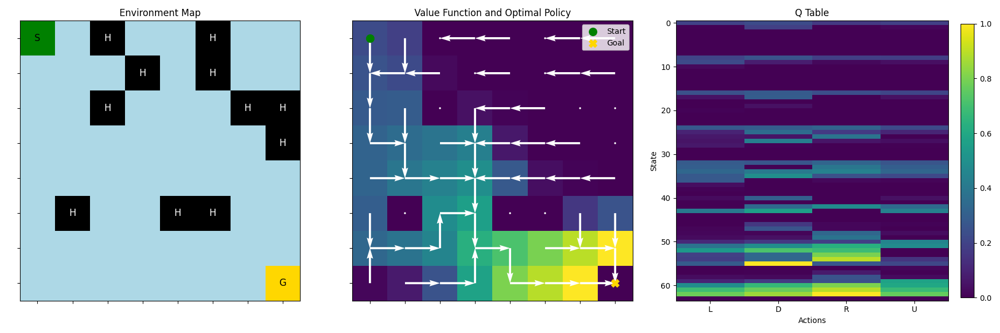

# Monte Carlo Q-Learning for Frozen Lake Environment

Simple implementation of a first visit, constant alpha, epsilon-greedy Monte Carlo Q-Learning algorithm for the discrete [Frozen Lake environment](https://gymnasium.farama.org/environments/toy_text/frozen_lake/). 

Here's a pic showing the environment, the learned policy and the value function:

Still need to mess with hyperparameters in the the slippery environment (and perhaps use a better algorithm), but it works fine for the deterministic case.